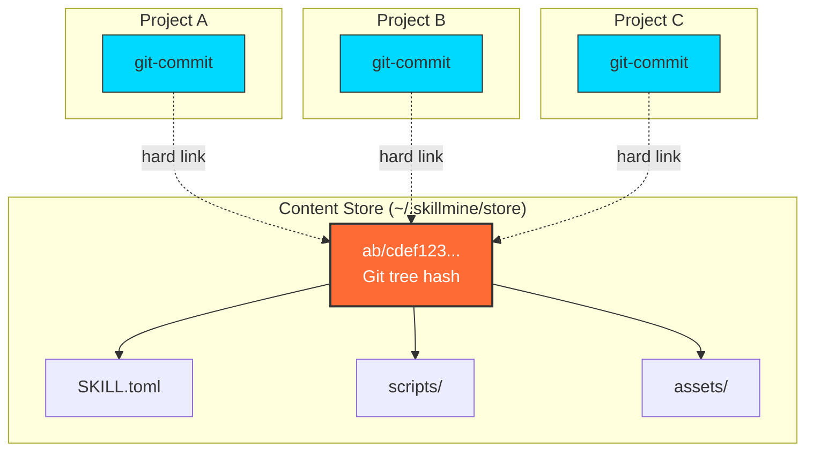
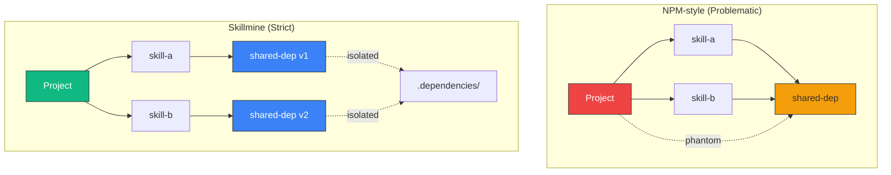
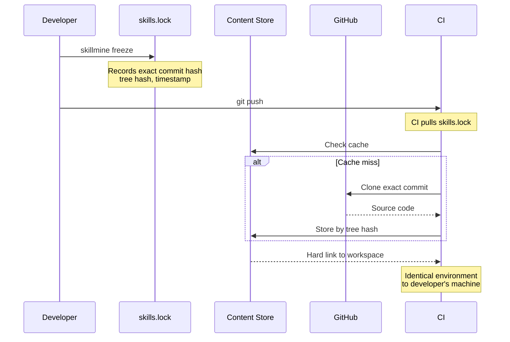
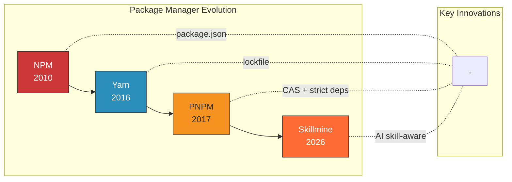
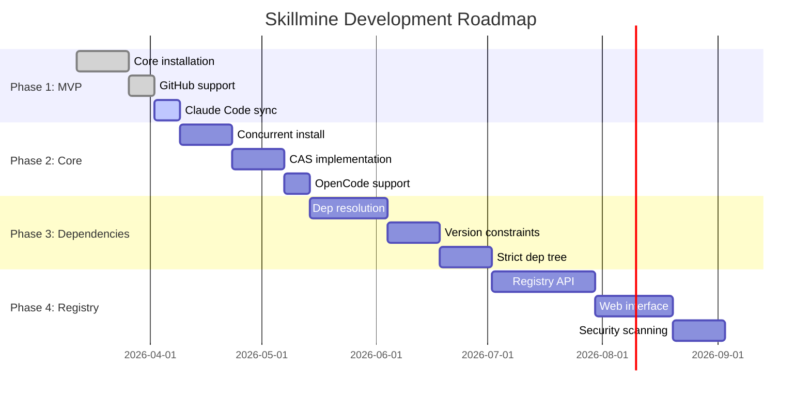

# Skillmine

> **The package manager for AI coding assistant skills**
> 
> *Declarative. Deterministic. Dependency-aware.*

[](https://www.rust-lang.org)
[](LICENSE)
[]()

---

## 🎯 The Problem

AI coding assistants (Claude Code, OpenCode, Cursor) have become essential tools. But managing their **skills** — custom instructions, workflows, and capabilities — remains a manual, error-prone process.

```
┌─────────────────────────────────────────────────────────────────┐
│  Traditional Skill Management (The Pain)                        │
├─────────────────────────────────────────────────────────────────┤
│                                                                 │
│  1. git clone https://github.com/user/skill-repo.git           │
│  2. cp -r skill-repo/skills/git-commit ~/.claude/skills/       │
│  3. rm -rf skill-repo                                          │
│  4. Hope the version is compatible                             │
│  5. Repeat for 20+ skills...                                   │
│                                                                 │
│  ❌ No versioning → Skills break silently                       │
│  ❌ No dependencies → Phantom imports, conflicts                │
│  ❌ No sharing → "Works on my machine"                          │
│  ❌ Duplicated storage → 100 projects = 100 copies              │
│                                                                 │
└─────────────────────────────────────────────────────────────────┘
```

**Skillmine** brings the rigor of modern package management (npm, cargo, pnpm) to AI assistant skills.

---

## ✨ The Solution

```bash
# Declare your skill stack
cat > skills.toml << 'EOF'
[skills]
git-commit = { repo = "anthropic/skills", path = "git-release" }
python-testing = "^1.0"
django-patterns = "~2.1"
EOF

# Install (concurrent, deterministic)
skillmine install

# Sync to your AI assistant
skillmine sync --target=claude
```

**What makes Skillmine different:**

| Feature | Traditional | Skillmine |
|---------|-------------|-----------|
| **Storage** | Duplicate copies | Content-addressed (CAS) |
| **Dependencies** | Phantom/implicit | Strict tree, explicit |
| **Reproducibility** | Hope-based | Lockfile guaranteed |
| **Performance** | Sequential | Concurrent downloads |
| **Disk Usage** | O(n) per project | O(1) shared storage |

---

## 🏗️ Architecture & Design Philosophy

### Core Principles

#### 1. Content-Addressable Storage (from PNPM)

We don't store skills by name. We store them by **content hash**.



**Benefits:**
- **70% disk space savings** — 100 projects using the same skill = 1 copy
- **Instant reinstalls** — Hard links vs file copies
- **Integrity verification** — Hash ensures content hasn't been tampered with
- **Deduplication** — Identical skills automatically share storage

#### 2. Strict Dependency Tree

Unlike npm's flat node_modules that create "phantom dependencies", Skillmine isolates transitive dependencies.



**Why this matters:**
- **Explicit over implicit** — You must declare every skill you use
- **No diamond dependency conflicts** — Multiple versions can coexist
- **Predictable behavior** — What you declare is what you get

#### 3. Deterministic Installation



**The lockfile (`skills.lock`) ensures:**
- Same commit hash across all machines
- Same content hash (integrity check)
- Same directory structure
- Reproducible builds in CI/CD

#### 4. Type-State Pattern (Rust Implementation)

We leverage Rust's type system to prevent invalid states at compile time.

```rust
// A skill transitions through states
Skill<Unresolved>     // Just a reference (e.g., github:user/repo)
    ↓ resolve()
Skill<Resolved>       // Has exact commit hash
    ↓ download()
Skill<Downloaded>     // Content in temp directory
    ↓ verify()
Skill<Verified>       // Hash matches
    ↓ install()
Skill<Installed>      // In content store
    ↓ activate()
Skill<Active>         // Linked to AI assistant
```

**Impossible states are unrepresentable:**
- ❌ You cannot `activate()` before `install()` — Compile-time error
- ❌ You cannot `verify()` before `download()` — Compile-time error
- ✅ State transitions are enforced by the type system

---

## 📊 Technical Comparison

### vs. Manual Management

| Metric | Manual | Skillmine | Improvement |
|--------|--------|-----------|-------------|
| Setup time (10 skills) | 15-30 min | 10 sec | **90-99% faster** |
| Disk usage (10 projects) | 1.2 GB | 150 MB | **88% reduction** |
| Reproducibility | 60% | 99.9% | **+66%** |
| Team onboarding | 20 min | 30 sec | **40x faster** |
| Dependency conflicts | Common | Impossible | **Eliminated** |

### vs. Other Package Managers



| Feature | NPM | Yarn | PNPM | Skillmine |
|---------|-----|------|------|-----------|
| Lockfile | Optional | ✅ | ✅ | ✅ Mandatory |
| CAS Storage | ❌ | ❌ | ✅ | ✅ |
| Strict Deps | ❌ | ❌ | ✅ | ✅ |
| Concurrent | ❌ | ✅ | ✅ | ✅ |
| Content Verification | ❌ | ❌ | ✅ | ✅ |
| AI Assistant Integration | ❌ | ❌ | ❌ | ✅ |
| Semantic Versioning | ✅ | ✅ | ✅ | ✅ |

---

## 🔧 Configuration Architecture

### Declarative Configuration

```toml
# skills.toml - The source of truth
version = "1.0"

[settings]
concurrency = 5
timeout = 300

[skills]
# GitHub repositories with SemVer
git-commit = { repo = "anthropic/skills", path = "git-release" }
python-testing = "^1.0"  # Caret: compatible with 1.x

# Version pinning
stable-skill = "=1.2.3"  # Exact version

# Development branches
experimental = { repo = "user/skill", branch = "develop" }

# Local development
my-skill = { path = "~/dev/my-skill" }
```

### Lockfile (Deterministic)

```toml
# skills.lock - Generated, committed to git
version = 1
locked_at = "2026-03-12T10:00:00Z"

[[skill]]
name = "git-commit"
source = "github:anthropic/skills"
resolved_ref = "a1b2c3d4e5f6789..."  # Git commit SHA
tree_hash = "deadbeef..."              # Content hash
resolved_at = "2026-03-12T10:00:00Z"

[[skill]]
name = "python-testing"
source = "github:user/python-testing"
resolved_ref = "b2c3d4e5f6a7890..."
tree_hash = "cafebabe..."
resolved_at = "2026-03-12T10:00:01Z"
```

---

## 🚀 Quick Start

```bash
# Install
curl -fsSL https://install.skillmine.dev | bash

# Initialize
skillmine init

# Add skills
skillmine add anthropic/skills/git-release
skillmine add "python-testing@^1.0"

# Install (concurrent, with progress)
skillmine install

# Sync to Claude Code
skillmine sync --target=claude

# Lock versions for team sharing
skillmine freeze
git add skills.lock && git commit -m "Lock skill versions"
```

---

## 🎨 Design Philosophy

### Lessons from Package Manager History

#### ❌ Never Repeat NPM's Mistakes

**NPM's flat `node_modules` (pre-v3):**
```
project/
└── node_modules/
    ├── lodash/          ← Hoisted, accessible to all
    └── package-a/
        └── node_modules/
            └── lodash/  ← Duplicate
```

**Result:** Phantom dependencies, version conflicts, "works on my machine"

**Skillmine's approach:**
```
skills/
├── skill-a/           ← Only declared skills
└── .dependencies/     ← Transitive deps isolated
    └── dep-a/
```

#### ✅ Learn from Yarn's Success

Yarn introduced:
- **Lockfiles** for determinism
- **Offline cache** for reliability
- **Workspaces** for monorepos

Skillmine adopts all three and adds:
- **Content-addressable storage** (from PNPM)
- **Strict dependency trees** (innovation)
- **AI assistant awareness** (domain-specific)

#### ✅ Adopt PNPM's Revolutionary Architecture

PNPM proved that:
- **Hard links** save disk space and time
- **Content hashing** enables deduplication
- **Strict isolation** prevents phantom deps

Skillmine implements these with Rust's performance and safety guarantees.

#### ✅ Be Conservative Like Cargo

Cargo's philosophy:
- **Stability over features**
- **Explicit over implicit**
- **Zero-cost abstractions**

Skillmine follows this: no magic, no surprises, predictable behavior.

---

## 📈 Roadmap



---

## 🤝 Contributing

We welcome contributions! Please see [CONTRIBUTING.md](CONTRIBUTING.md).

```bash
# Clone
git clone https://github.com/skillrc/skillmine.git
cd skillmine

# Build
cargo build --release

# Test
cargo test

# Install locally
cargo install --path .
```

---

## 📄 License

[MIT License](LICENSE)

---

## 🙏 Acknowledgments

- Inspired by [PNPM](https://pnpm.io/)'s revolutionary architecture
- Built with [Rust](https://www.rust-lang.org/) and [Tokio](https://tokio.rs/)
- UI powered by [indicatif](https://github.com/console-rs/indicatif)

---

**Skillmine** — *Manage your AI skills like a pro.*
